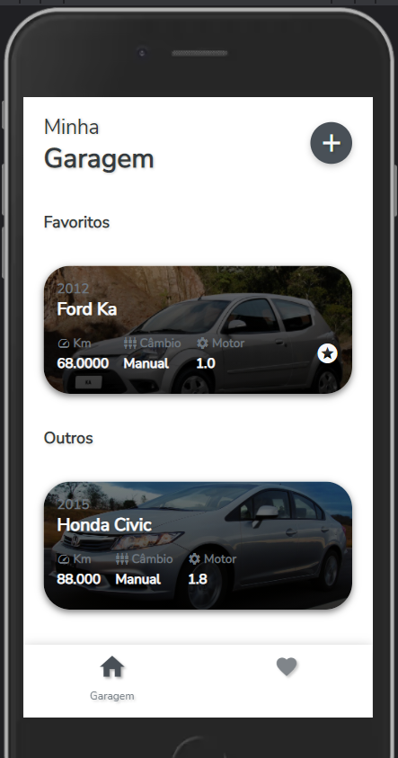
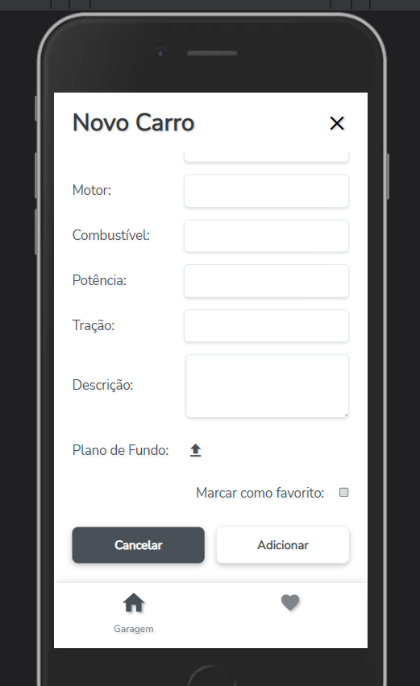
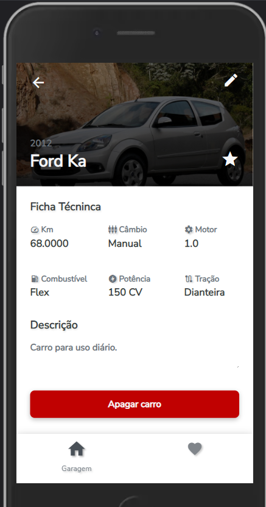
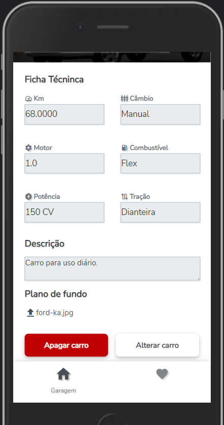
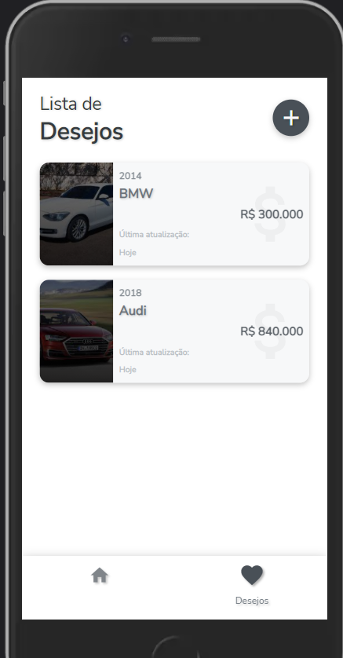
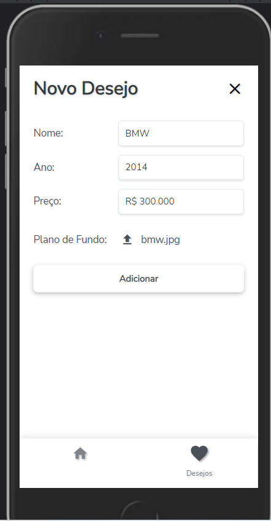
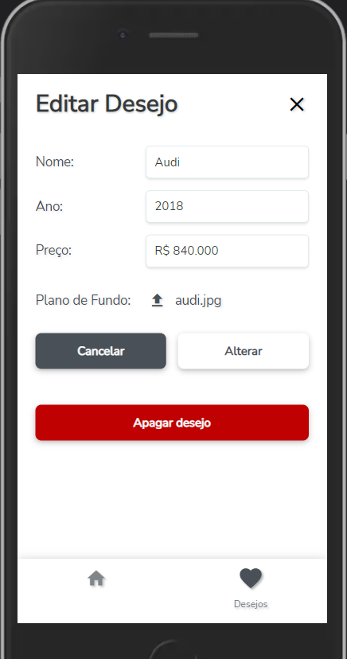

# MINHA GARAGEM

**Bruno Maurício Silveira de Andrade**

O objetivo desta aplicação é realizar a gestão de carros presentes em sua garagem, possibilitando o cadastro completo de todos seus carros. E também é possível criar uma lista de desejos, adcionando carros que tem um desejo de adquirir no futuro.

Link produção: https://mygarage-react.vercel.app/

## 1. Interfaces

### Tela principal

Nesta tela, o usuário será capaz de visualizar todos os carros que foram cadastados anteriormente. Se existirem favoritos, a lista de favoritos fica no topo para uma melhor busca. Caso queira visualizar todas as informações sobre esse carro, ainda é capaz de clicar no carro e navegar para outra tela contendo todas as informações cadastradas anteriormente.

### Tela de Cadastrar Carro

Nesta outra tela, o usuário será capaz de preencher o formulário sobre o carro que deseja cadastar em sua garagem. Além de informações textuais, como nome, ano e km, ele poderá colocar um plano de fundo com a foto de seu carro, para ficar mais personalizado. E por último ainda pode marcar como favorito, se for um carro que utiliza muito dentro aqueles que estão em sua garagem, e então ele irá para o topo da lista.

### Tela de Editar/Visualizar Carro

Nesta outra tela, o usuário será capaz de visualizar todas as informações do carro selecionado anteriomente. E também será capaz de editar qualquer informação do carro, inclusive adcionar como favorito ou até mesmo excluir aquele carro de sua garagem.

### Tela de Lista de Desejos

Nesta outra tela, o usuário será capaz de visualizar todos os desejos que foram cadastados anteriormente. Caso queira editar alguma das informações sobre esse desejo, ainda é capaz de clicar no desejo e navegar para outra tela contendo todas as informações cadastradas anteriormente.

### Tela de Cadastrar Desejo

Nesta outra tela, o usuário será capaz de preencher o formulário sobre o novo desejo. Além de informações textuais, como nome, ano e preço, ele poderá colocar um plano de fundo com a foto de seu carro desejado, para ficar mais personalizado.

### Tela de Editar Desejo

Nesta outra tela, o usuário será capaz de visualizar todas as informações do desejo selecionado anteriomente. E também será capaz de editar qualquer informação do desejo, ou até mesmo excluir aquele desejo de sua lista.

## 2. Dados do usuário

Nesta aplicação, os dados do usuário que são armazenados são aqueles informados no momento do cadastro do carro (nome do carro, ano, plano de fundo, etc) ou do desejo (nome do carro, ano, preço e plano de fundo). Armazenando todas essas informações, é possível garantir que todos os cadastros permaneçam salvos apos recarregar a página.

## 3. Checklist de implementação

- A aplicação é original e não uma cópia da aplicação de um colega ou de uma aplicação já existente? **Sim**
- A aplicação tem pelo menos duas interfaces (telas ou páginas) independentes? **Sim**
- A aplicação armazena e usa de forma relevante dados complexos do usuário? **Sim**
- A aplicação possui um manifesto para instalação no dispositivo do usuário? **Sim**
- A aplicação foi desenvolvida com o React? **Sim**
- A aplicação contém pelo menos dois componentes React além do componente principal? **Sim**
- A aplicação possui um _service worker_ que permite o funcionamento off-line? **Sim**
- O código da minha aplicação possui comentários explicando cada operação? **Sim**
- A aplicação está funcionando corretamente? **Sim**
- A aplicação está completa? **Sim**
